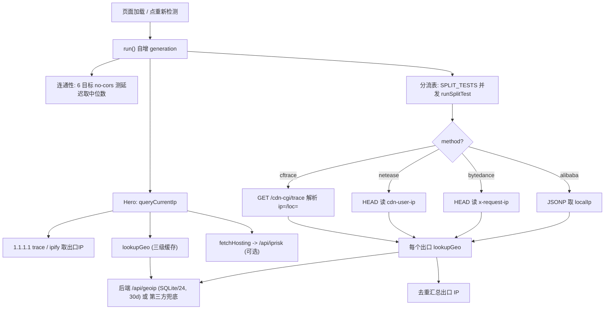

# 实现原理与开发过程（DESIGN）

本文记录 **ip-check** 是「如何一步步实现的」：核心检测原理、四种回显方法、整体架构与数据流、前后端各模块职责、关键设计取舍，以及从零到上线的步骤顺序。

---

## 1. 要解决的问题

代理客户端（Xray-core / sing-box / Clash 等）通常配置了**分流规则**：不同域名走不同的出口（直连 / 香港节点 / 美国节点 / 落地机房…）。
肉眼无法确认「我访问 ChatGPT 到底走了哪个出口、访问淘宝是不是直连」。本工具就是在浏览器里**逐个网站探测实际出口 IP**，把分流规则的真实效果可视化。

---

## 2. 核心原理

**关键洞察：分流规则作用在「客户端按目标域名选出口」这一步，所以检测必须在浏览器里、针对每个目标域名各发一个请求。** 在服务端探测是没用的——服务端看不到你本地代理的分流决策。

思路是：对每个目标网站，发起一个**能让对端把「它看到的来源 IP」回显给我们**的请求。代理会按该域名的规则选出口，于是回显出来的 IP 就**暴露了这条规则走的出口**。

把对所有目标网站拿到的出口 IP 去重，就得到「这套分流配置一共用了几个出口」。出口越多 = 分流越细。

难点在于浏览器的**同源策略（CORS）**：默认读不到跨域响应。所以要挑选那些「能跨域回显 IP」的端点，归纳出下面 4 种方法。

---

## 3. 四种回显方法

实现位置：`frontend/src/lib/detect.ts`；每个目标用哪种方法在 `frontend/src/lib/config.ts` 的 `SPLIT_TESTS` 里声明。

| 方法 | 适用站点 | 原理 | 如何绕过 CORS |
|---|---|---|---|
| **cftrace**（主力） | 所有走 Cloudflare 的站点 | `GET https://<域名>/cdn-cgi/trace`，纯文本里有 `ip=<出口IP>`、`loc=<国家码>`，是 CF 边缘看到的来源 | 该端点响应允许跨域读取，直接 `fetch` 取 `text()` 解析 |
| **netease** | 网易系 | `HEAD` 网易 CDN 资源，读响应头 `cdn-user-ip` | 服务端用 `Access-Control-Expose-Headers` 暴露了该头 |
| **bytedance** | 字节系（国内/海外） | `HEAD` 字节基准资源，读 `x-request-ip` / `x-response-cinfo` | 同上，暴露了自定义头 |
| **alibaba** | 阿里云 | 请求 `*.dns-detect.alicdn.com` 的 JSONP 接口，回调里有 `content.localIp` + `ipCountry` | 用 `<script>` 标签 JSONP，天然不受 CORS 限制 |

要点：
- cftrace 覆盖面最广，是绝大多数国际站点的探测方式；支持 `fallbackDomain`：主域名没返回 trace 时换备用域名重试（见 `runSplitTest`，detect.ts:88-102）。
- netease/bytedance 靠**响应头**回显，所以用 `HEAD` 省流量。
- alibaba 靠 **JSONP** 回显，是唯一用 `<script>` 而非 `fetch` 的方法。
- 统一超时 6s（`TIMEOUT_MS`）；`runSplitTest` 把四种方法的结果归一成 `{ ip, countryCode }`。

> 表里出现「未获取到 IP」通常是该站点这一刻没走 Cloudflare / 没返回 trace（例如 `cloudflare.com` 自身），属于预期，不代表网络异常。

---

## 4. 当前出口 IP（Hero）

实现：`frontend/src/lib/ip.ts`。

- `fetchEgressIp()`：先 `GET https://1.1.1.1/cdn-cgi/trace` 拿默认出口 IP + 国家码（来源标 `Cloudflare`）；失败回退 `api.ipify.org`（来源标 `ipify`）。
- `queryCurrentIp()`：拿到 IP 后**并行**做两件事——`lookupGeo(ip)` 查归属地，`fetchHosting(ip)` 问后端这是不是机房 IP（驱动「🏢 机房 / 🏠 住宅」徽标）。后端不可用时 `isHosting=null`，UI 显示未知，不报错。

---

## 5. 网络连通性 / 延迟

实现：`frontend/src/lib/ping.ts`。

浏览器不能发 ICMP ping，于是用 `fetch(..., { mode: 'no-cors' })` 计时近似：
- `no-cors` 读不到响应内容，但**请求往返耗时**够用。
- 每个目标打 `rounds=5` 次，**取中位数**（对抖动/离群点更稳健）；每轮间隔 120ms 避免连接复用导致的偏差；全失败返回 `null`（显示「超时」）。

---

## 6. 地理位置查询与多级缓存

实现：`frontend/src/lib/geo.ts`。`lookupGeo()` 是三级缓存：

1. **L1 内存缓存** `geoCache`：同一次会话里命中直接返回。键按 **/24 归一**（`1.2.3.4` → `1.2.3.1`），相邻地址共享一条，省请求。
2. **L2 in-flight 去重** `geoInflight`：同一个 IP 并发查询时只发一个真实请求，其余 await 同一个 Promise。
3. **L3 真正取数**：先打自己的后端 `/api/geoip/{ip}`（`fetchGeoFromServer`），失败再回退第三方 `api.ip.sb` → `ipwho.is`（`fetchGeoFallback`）。

> 关键修复（Devin Review）：**只缓存成功结果**（`if (result) geoCache.set(...)`，geo.ts:80）。否则一次瞬时失败会被永久缓存成 null，重试也拿不到。

---

## 7. 后端（可选增强）

实现：`backend/app/`，FastAPI。前端把它当**可选**项，挂了就优雅降级到第三方。

- `GET /api/geoip/{ip}`：归属地。按 **/24（IPv4）/ /48（IPv6）** 子网键缓存，TTL 30 天。
- `GET /api/iprisk/{ip}`：ASN + `hosting/proxy/mobile` 标志 + 0–100 风险分。按单 IP 缓存，TTL 7 天。
- `GET /healthz`：存活探针。
- 数据源（`providers.py`）：主用 `ip-api.com`（免费、带 hosting/proxy/mobile 标志），`ipwho.is` 兜底纯 geo。
- 风险评分（`_score`，providers.py:97-116）：机房 ASN +55、已知代理/VPN +35、移动网 +5、云厂商 ASN 命中（amazon/google/azure/ovh/…）+15，上限 100。
- 缓存（`cache.py`）：SQLite 的 KV 表 + 过期时间，路径 `IPCHECK_DB_PATH`（默认 `/data/ipcheck.db`），挂卷即持久化。
- CORS：`allow_origins=["*"]`、仅 `GET`，方便跨域静态前端调用。

为什么 geo 按 /24、risk 按单 IP？归属地在一个 /24 内基本一致，可粗粒度缓存提升命中率；而风险/代理判定对单个 IP 更敏感，所以精确到 IP。

---

## 8. 编排：useDetector + generation 计数器

实现：`frontend/src/composables/useDetector.ts`，是页面的总调度。一次 `run()` 并发跑三条线：① Hero 出口 IP ② 连通性 ③ 分流表。分流表与连通性都用 `runWithLimit`（`frontend/src/lib/concurrency.ts`）做**并发上限**，避免一次性几十个请求打满浏览器连接数。

**re-run 竞态问题与解法（Devin Review）**：用户点「重新检测」会再次 `run()`，但上一轮的异步 worker 可能还在飞，回来后会把**旧结果写到新一轮的状态上**。解法是 **generation 计数器**：
- 模块内 `let generation = 0`；每次 `run()` 执行 `const gen = ++generation`。
- 每个 worker 捕获自己的 `gen`，**每次写响应式状态前都校验 `if (gen !== generation) return`**——一旦被新一轮取代就变成 no-op。
- `run()` 开头还会立刻重置 `rows/pings/ipLoading`，让 UI 立即进入「加载中」。

这样任何被取代的旧 worker 都不会污染新结果。

---

## 9. 优雅降级（前端可独立运行）

`API_BASE`（来自构建期 `VITE_API_BASE`）为空且处于生产构建时，`fetchGeoFromServer` / `fetchHosting` 直接返回 null，跳过后端。所以**纯静态部署也能用**：geo 走第三方、没有「机房 IP」徽标和服务端缓存，其余功能不变。这就是预览站 https://dist-stnpaudz.devinapps.com 的运行方式。

---

## 10. 整体数据流

每次写状态前都过一遍 generation 校验（见第 8 节）。

---

## 11. 从零到上线的步骤顺序

这是当初实际的实现顺序，可作为复刻参考：

1. **验证原理**：先手动 `curl https://x.com/cdn-cgi/trace`，确认能跨域拿到 `ip=`，再确认网易/字节响应头、阿里 JSONP 可读——原理跑通才开工。
2. **搭脚手架**：Vite + Vue 3 + TS。先定 `types.ts`（`SplitTest`/`CurrentIp`/`PingState`/`RowState`/`GeoResult`）。
3. **写探测原语**：`detect.ts` 四种方法 + `runSplitTest` 归一；`ip.ts` 出口 IP；`ping.ts` 延迟中位数。
4. **配置目标清单**：`config.ts` 的 `SPLIT_TESTS`（国内/国际 + 分类标签）与连通性目标。
5. **geo 与缓存**：`geo.ts` 三级缓存 + /24 归一 + 第三方兜底。
6. **编排**：`useDetector.ts` 把三条线并发起来，加并发上限。
7. **UI**：`App.vue` + `HeroPanel/IpSummary/SplitTable` 组件 + `styles.css`（亮/暗双主题）。
8. **后端（可选）**：FastAPI `geoip`/`iprisk` + 风险评分 + SQLite TTL 缓存；前端做成可选依赖、自动降级。
9. **加固**：generation 计数器防 re-run 竞态；只缓存成功的 geo；分流清单去重。
10. **上线**：前端静态构建部署预览；后端写 `Dockerfile` 自部署（见 `DEPLOY.md`），前端用 `VITE_API_BASE` 重建指向后端。

---

## 12. 已知限制

- **要演示分流差异，必须在已配置代理（Xray-core/sing-box 等）的浏览器里跑**；裸网络下所有站点都是同一个出口 IP，只能验证「探测机制本身」。
- 依赖各家端点的回显行为，若对方改了响应头/接口，对应方法会失效（cftrace 最稳）。
- 第三方 geo / `ip-api.com` 有速率限制，故有后端缓存与多源兜底。

---

相关文档：部署见 [`DEPLOY.md`](./DEPLOY.md)，使用与配置见 [`README.md`](./README.md)。
